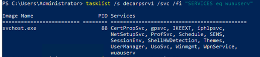
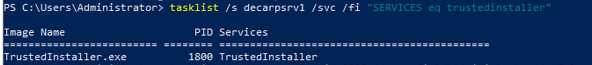

# a collection of PowerShell and CMD commands I use
## software
- `WinDirStat` - Used for finding where space is being taken up (Run As Administrator to find everything that is taking up space)
- `Prime95` - cpu benchmarking/stress testing suite
- `Memtest86` - memory testing suite
- `Furmark` - gpu benchmarking/stress testing suite

## power
`powercfg` is the main utility for editing power related options. powercfg can also be used to generate a report based on the battery status including all information from the lifetime of the install, this information covers capacity, usage patterns, etc.

- `powercfg /batteryreport` (this will generate a HTML document that contains all information relating to the battery)

- `powercfg -duplicatescheme e9a42b02-d5df-448d-aa00-03f14749eb61` (adds the ultimate performance power plan, not sure if this is supported on Windows 11)

## networking
`netsh` is the main utility for interacting with the network stack configuration. it provides interfaces to different systems in place that make the network stack work. 

- `netsh int ip reset` (resets the TCP/IP stack, it will delete any static IP addresses set on the device)
- `netsh winsock reset` (winsock is the underlying Windows library for handling TCP/UDP requests)
- `netsh winhttp reset proxy` (this will fix issues where the client is reporting no internet connection but can make and receive requests to the wider network, a lot of devices still have the old XG proxy in place which fails the initial msft connect tests) 

- `ipconfig /release` (release the current DHCP record)
- `ipconfig /renew` (requests a new DHCP record)
- `ipconfig /flushdns` (removes all cached DNS entries from the client) 

## updates

When Windows updates are stuck 100% on a VM the update service can be stopped and bypassed using remote tasklist and taskkill program command flags.

### Finding the relevant service process IDs:

- `tasklist /s <remote_host> /svc /fi "SERVICES eq wuaserv"`
- `tasklist /s <remote_host> /svc /fi "SERVICES eq trustedinstaller"`

Example output:

Now we have the process IDs for the services causing the update hang. Both can be closed remotely from the host using taskkill:

- `taskkill /s <remote_host> /pid 88 /pid 1800 /u <domain>\<user> /p <pwd>`

The above command should instantly load the Windows instance to the login prompt. From here you can check events, clear software distribution, etc.

## clearing space
### CSC clean up
Windows stores "online" files within a local database that acts as a cache. This cache builds up over time and can take up extensive amounts of space. I think there is meant to be a clean up process under task scheduler, however I couldn't find this upon looking.

CSC listens for a registry key to start the clean up process, we can add this key to trigger the clean up whenever. The only issue that occurs is the database gets fully cleared so the user may experience slow downs for a little while until files are cached again. 

Adding the registry key (a computer reboot is required to complete the process):

- `reg add "HKLM\SOFTWARE\Microsoft\Windows\CurrentVersion\NetCache" /v FormatDatabase /t REG_DWORD /d 1 /f`
- `Restart-Computer -Force` 

### Cleaning the base Windows image
Windows has a tool called DISM that is used for Windows image manipulation. This manipulation includes mounting, repacking, checking live images, etc.  

To refresh the current live image:

- `dism.exe /online /cleanup-image /startcomponentcleanup`
- `dism.exe /online /cleanup-image /startcomponentcleanup /resetbase`
- `dism.exe /online /cleanup-image /startcomponentcleanup /spsuperseded`
